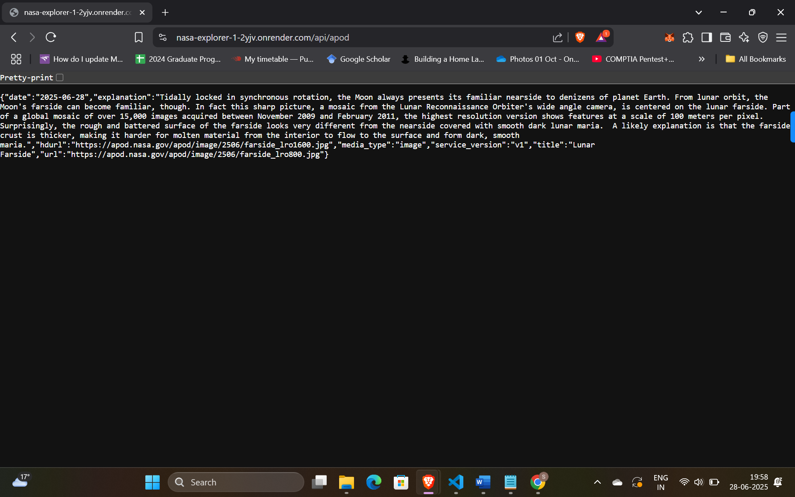
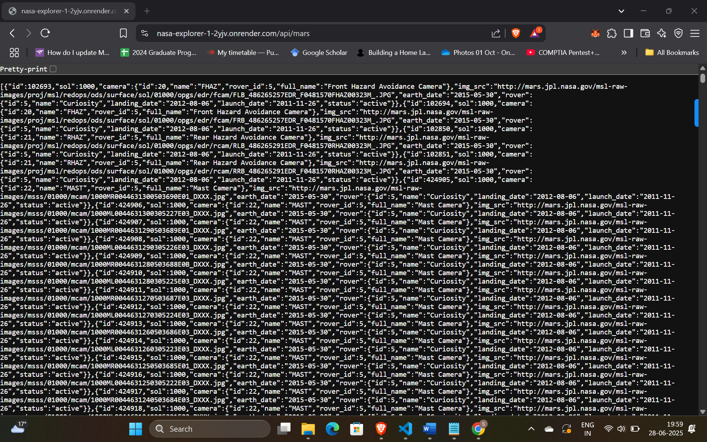

1. Project Overview

NASA Explorer is a modern web application that fetches and visualizes real-time data from various NASA APIs. It includes:
-  (Astronomy Picture of the Day)
- Mars Rover Photos (with filtering & lightbox)
- NEO (Near-Earth Objects) data with charts
- EPIC Earth imagery in a carousel
- NASA Image & Video Library search
- Space Fact Generator via OpenAI
- User Authentication using JWT
This is Deployed using Vercel(Front-end) and Render(BAck-end).

2. Features
NASA API Integrations
- APOD: Astronomy Picture of the Day with date filter
- Mars Rover Explorer: Rover + camera + sol filtering, pagination, lightbox viewer
- NEO Dashboard: Visualize near-Earth objects with Recharts
- EPIC Viewer: Earth image carousel from DSCOVR satellite
- NASA Library Search: Search and preview multimedia assets

Authentication
- JWT-based login/register
- MongoDB user storage
- Protected profile route with JWT token

AI Integration
- OpenAI-powered "Space Fact of the Day" (cached daily)

Visualizations
- Charts for asteroid size and miss distance using Recharts

Tested Backend
- Jest-based unit and integration tests for all endpoints

3. Tech Stack

| Layer       | Tech Used                                  |
|-------------|---------------------------------------------|
| Frontend    | React.js, Bootstrap, Axios, React Router    |
| Backend     | Node.js, Express.js, TypeScript             |
| Database    | MongoDB + Mongoose                          |
| Charts      | Recharts                                    |
| Auth        | JWT (JSON Web Tokens), bcrypt               |
| AI          | OpenAI API (GPT-3.5-turbo)                  |
| Deployment  | Vercel (Frontend), Render (Backend)         |

4. Folder Structure

/nasa-explorer
│
├── /backend
│   ├── /routes            # API route handlers
│   ├── /models            # MongoDB models
│   ├── /middleware        # Auth middleware
│   ├── /config            # MongoDB config
│   ├── /tests             # Jest test files
│   └── index.ts           # App entry point
│
├── /frontend
│   ├── /pages             # UI views (APOD, Mars, NEO, etc.)
│   ├── /components        # Shared UI components
│   ├── /context           # AuthContext
│   ├── App.js             # Main router
│   └── index.js           # App entry point

5. Dependencies & Installation

- Backend

cd backend

# Runtime Dependencies
npm install express cors dotenv mongoose axios jsonwebtoken bcrypt

# Dev Dependencies
npm install --save-dev typescript ts-node nodemon @types/node @types/express @types/jsonwebtoken @types/bcrypt

# Testing
npm install --save-dev jest ts-jest supertest @types/jest @types/supertest

- Frontend

cd frontend

npm install axios bootstrap react-router-dom recharts

## React Testing Library setup was planned but didn’t finalize due to compatibility issues.

6. Environment Setup

Create a .env file in the /backend directory with following contents :

PORT=5000
MONGO_URI=your_mongodb_connection_string
JWT_SECRET=your_jwt_secret
NASA_API_KEY=your_nasa_api_key
OPENAI_API_KEY=your_openai_api_key

7. Local Setup Guide

- Prerequisites
  Node.js (v18+)
  MongoDB installed locally or use MongoDB Atlas
  npm
  Git
  Postman (recommended)

---

- Backend Setup

cd backend
npm install

# Add a .env file
PORT=5000
MONGO_URI=mongodb://127.0.0.1:27017/nasa-explorer
JWT_SECRET=your_secret_key
NASA_API_KEY=your_nasa_api_key
OPENAI_API_KEY=your_openai_key

# Start server
npm run dev

Runs at: http://localhost:5000

- Frontend Setup

cd frontend
npm install

# Start frontend
npm start

Runs on: http://localhost:3000

8. API Endpoint Documentation
API Endpoints

| Endpoint              | Method | Description                       | Auth Required |
|-----------------------|--------|-----------------------------------|---------------|
| /api/auth/register    | POST   | Register new user                 | No            |
| /api/auth/login       | POST   | Login and get JWT token           | No            |
| /api/auth/profile     | GET    | Get logged-in user profile        | Yes           |
| /api/apod             | GET    | Astronomy Picture of the Day      | No            |
| /api/mars             | GET    | Mars Rover photos by sol/camera   | No            |
| /api/neo              | GET    | Near-Earth Object data            | No            |
| /api/epic             | GET    | EPIC Earth imagery                | No            |
| /api/library          | GET    | NASA media library search         | No            |
| /api/space-fact       | GET    | AI-generated space fact (cached)  | No            |

9. Deployment
| Part     | Platform | URL                                          |
| -------- | -------- | -------------------------------------------- |
| Frontend | Vercel   | `https://nasa-explorer-1.vercel.app/`        |
| Backend  | Render   | `https://nasa-explorer-1-2yjv.onrender.com/` |
Environment variables are managed via respective platform dashboards.|

You can now test backend routes like:

/api/apod

/api/mars

/api/neo

/api/epic

/api/space-fact

10. Screenshots of app running live:

Contributing

Pull requests and feedback are welcome. This project was built as a demonstration of full-stack skills using modern APIs and authentication practices.

Contact

Author: Shashank B  
GitHub: [github.com/ShashankB2103](https://github.com/ShashankB2103)

